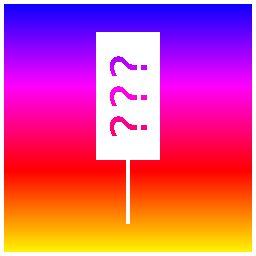

# gtamaplib-vc

(vc stands for vibe-coded, not for Vice City!)

**gtamaplib-vc** is a collection of interfaces and tools on top of [gtamaplib](https://github.com/rolux/gtamaplib), including a UI for browsing the map, cameras and landmarks, an annotation editor, and a fast and furious optimizer that improves existing calibrations and triangulations. (We have also just added a full-3D game mode.)

## TL;DR

Run:

```bash
git clone https://github.com/rolux/gtamaplib-vc.git
cd gtamaplib-vc
python3 -m pip install -r requirements.txt
python3 bootstrap.py
python3 server.py
```

Then open:

```text
http://127.0.0.1:8026/
```

To update:

```bash
git pull
python3 update.py
```

If something doesn't work:

**Ask ChatGPT or Claude first.**

## Setup

Clone this repository, then `cd` into the `gtamaplib-vc` directory:

```bash
git clone https://github.com/rolux/gtamaplib-vc.git
cd gtamaplib-vc
```

Install Python dependencies. That's just 'numpy', 'scipy', 'Pillow' and 'tqdm'. If you prefer `uv` over `pip`, use `uv`.

```bash
python3 -m pip install -r requirements.txt
```

Then run the bootstrap script:

```bash
python3 bootstrap.py
```

The bootstrap script clones **[gtamaplib](https://github.com/rolux/gtamaplib)** into `./gtamaplib`, fetches its assets, sparse-checks out the latest map tiles from **[map.gtadb.org](https://map.gtadb.org)** into `./gtadb.org`, and then generates the local browser data.

## Server

Start the local UI server and editing API:

```bash
python3 server.py
```

Then open:

```text
http://127.0.0.1:8026/
```

The UI has a couple of useful keyboard shortcuts, like `up`/`down` for list navigation, and `esc` (or `cmd+click`) to deselect.

3D map view supports the most common Google Maps controls (`click+drag`, `cmd+click+drag`, etc), and `W`, `A`, `S`, `D` + `Q`, `E`, in addition to the arrow keys.

In game mode, the usual keyboard controls work as well, but we recommend using a controller.

## Updating

To update **gtamaplib-vc**, along with the linked **gtamaplib** and **gtadb.org** checkouts, and regenerate local browser data, run:

```bash
git pull
python3 update.py
```

Updating **gtamaplib** may change imported cameras, landmarks, observations, and pre-triangulated points. Existing optimizer results may no longer describe exactly the same starting data after an update. The same is true for updating **gtamaplib-vc** itself, which may change the behavior of the optimizer.

## Regenerating Data

`bootstrap.py` and `update.py` already run the importer, so you do not need to run `utils/import_data.py` after either command.

During development, if you only want to regenerate local browser data without pulling external repositories, run:

```bash
python3 utils/import_data.py
```

The importer writes `data/gtamapdata.json` from **gtamaplib**, creates editable `data/special.json` and `data/config.json` files if missing, writes generated VC additions to `data/import_extras.json`, creates `ui/data/overlay.json`, and generates thumbnails in `ui/thumbnails/`.

## Development Helpers

`generate_optimizer_chain.py` is an experimental helper for proposing a greedy optimizer chain from currently available calibration constraints. It writes the proposed chain and configs to `optimizer/generated/`, which can be run with `python3 optimize.py --generated`. Its ranking logic is still provisional.

## Observation Editing

The UI allows you to add, move, rename, and remove observations. These edits are stored locally in `data/observation_edits.json` and applied by the frontend on top of the current **gtamaplib** data. For now, these annotations are strictly private. We're going to add ways to share them in the near future.

`server.py` starts both the browser UI on port `8026` and the local editing API on port `8027`. You do not normally need to run the API separately.

If **gtamaplib** changes and you want to rebuild the generated upstream browser data, run:

```bash
python3 utils/import_data.py
```

This keeps **gtamaplib** as the upstream source of cameras, landmarks, frames, and initial observations, while allowing private local annotation edits in **gtamaplib-vc**. The optimizer uses the same model: load the imported **gtamaplib** data, then explicitly apply local observation edits on top.

## Optimizer

The optimizer chain lives in `optimizer/`:

```text
optimizer/chain.json
optimizer/priors.json
optimizer/configs/
optimizer/defaults/
optimizer/results/
optimizer/renders/
```

`optimizer/defaults/` contains the checked-in default chain and stage configs. `bootstrap.py` and `update.py` copy these into `optimizer/chain.json` and `optimizer/configs/` if they are missing, but never overwrite existing local files. The live chain and configs are intentionally ignored by git, so you can edit them freely.

`optimizer/chain.json` is a plain ordered list of camera names. Each camera has a matching config file in `optimizer/configs/` that lists the landmarks, rays, and objects used for that calibration stage.

For each stage, first inspect the configured and available inputs:

```bash
python3 optimize.py --stage 1 --config
```

Then run the stage:

```bash
python3 optimize.py --stage 1 --run
```

After the run, review the compact result summary:

```bash
python3 optimize.py --stage 1 --result
```

For more options, run:
```bash
python3 optimize.py --help
```

Each run writes a numbered result JSON into `optimizer/results/`, updates `optimizer/result.json` as the current complete optimizer world snapshot, and renders the current optimizer state into `optimizer/renders/`.

You can render a local log-loss landscape for any camera with:

```bash
python3 render_loss.py --camera "Leonida Keys 01 (Airplane) (X)"
```

The defaults are `--spacing 10`, `--budget 1000`, and `--max-steps 100`.

You can also render projections into `optimizer/renders/projections/`:

```bash
python3 project.py cam-onto-map "Leonida Keys 01 (Airplane) (X)" --output cam-onto-map.png
python3 project.py cam-onto-map "Keys" "Leonida Keys 01 (Airplane) (X)" "Leonida Keys Postcard (X)" --output cams-onto-map.png
python3 project.py map-into-cam "Leonida Keys 01 (Airplane) (X)" --output map-into-cam.png
python3 project.py cam-into-cam "Leonida Keys Postcard (X)" "Leonida Keys 01 (Airplane) (X)" --output cam-into-cam.png
python3 project.py map -5220 5580 200 135 -10 0 60 --output map.png
```

## Game Mode

To enter game mode, click `Fasten Seatbelts` in the 3D map view. The usual keyboard controls (and a few unusual ones) work, but we highly recommend plugging in a controller.

## Notes

Initial version inspired by prior work from Neutral_State on the GTA VI Mapping Discord.

Please keep in mind that v1.0.0 is pre-release software. Some parts may change quickly, others may still be unfinished.

**gtamaplib-vc** was written by Codex. The quality and readability of the code will reflect this.

If you have trouble setting it up, ask your own AI first. They should be able to help you out.

And if you have Claude or Codex, why not ask them to add your own favorite features? This is open source software, after all.

## 3D Tour video

[](https://www.youtube.com/watch?v=4l_GOzurTRA)